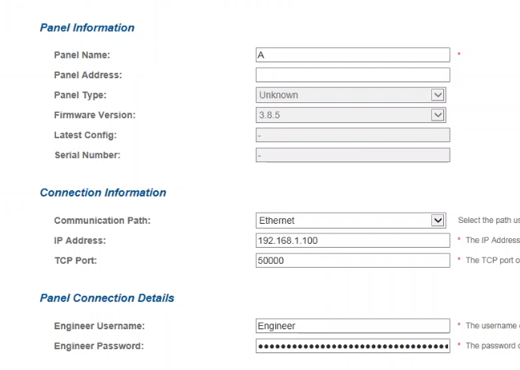
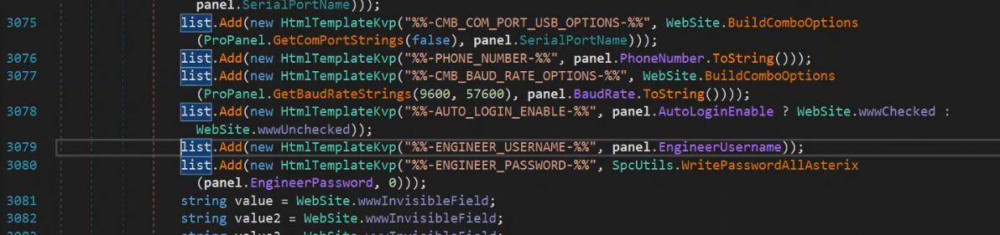
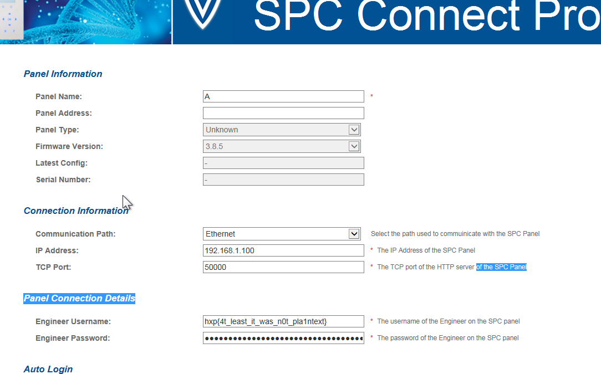

# Secure Program Config - hxp CTF 2020

Solved by Kaiziron - Team : Black Bauhinia
	
Solved on 2020-12-19 14:19 (Time in HK)

```
Difficulty estimate: easy

Points: round(1000 · min(1, 10 / (9 + [53 solves]))) = 161 points
```

## Description
```
Due to corona, I’m in home office and yesterday, I (while not being completely sober) played around with some alarm systems of the clients and … apparently … changed my engineer password since I cannot access anything anymore … my boss has called this morning and threatened to fire me if I don’t fix that ASAP … I have not the slightest idea what my password could be or how I can get it back … can you please help me recover it???!! I have to fix that mess somehow …

I removed the clients’ data to not get into even more trouble …

Before I forget: Download SPC Connect Pro and start it pointing to the folder SPC Products. (The software will ask you which directory it should use)

Our company login to the software is admin/admin. Luckily, I did not change that …

Oh no … my boss is calling again … we talk later … good luck.
```

Configuration files are given : [Secure Program Config-f0a3e4f922071458.tar.xz (716 Bytes)](https://2020.ctf.link/assets/files/Secure%20Program%20Config-f0a3e4f922071458.tar.xz)

## Solution
There are 2 files in the tar archive given, Panels.xml and Users.xml.

### Panels.xml
```
<?xml version="1.0" encoding="utf-8"?><LOCAL_PANELS><LOCAL_PANEL PANEL_ID="1" NAME="A" ADDRESS="" PANEL_TYPE="0" FIRMWARE_VERSION="3.8.5" SERIAL_NUMBER="0" COMMS_PATH="1" IP_ADDRESS="192.168.1.100" TCP_PORT="50000" SERIAL_PORT_NAME="COM1" PHONE_NUMBER="0" BAUD_RATE="57600" AUTO_LOGIN_ENABLE="1" ENGINEER_USERNAME="Engineer" ENGINEER_ENCPASS="a+otqmLSU92rzNnOXGwaCehJjoX8FIlazg+TCelmsEryWnRfLLyXEsqs9mu4dQqJ" /></LOCAL_PANELS>
```

### Users.xml
```
<?xml version="1.0" encoding="utf-8"?><USERS><USER USERNAME="admin" PASSWORD_HASH="0x45B26F886EE4299B5DBEBFB852B06718B5EEF1F2" FIRST_NAME="admin" LAST_NAME="" LANGUAGE="0" /></USERS>
```


The password of engineer is encrypted and stored in Panels.xml, we need to install SPC Connect Pro and point it to the folder SPC Products according to the description.

After SPC Connect Pro is installed, the credentials to login is admin/admin according to the description.

After logging it, we can see that the password of the Engineer is decrypted but hidden from us and we are unable to copy or view it.



I discovered that the executable is in .NET and can be decompiled with dnSpy easily.



The username is showing in plaintext and password is hidden, so I make some changes to the line.

The textbox showing the username originally is modified to show the password in plaintext.

```
list.Add(new HtmlTemplateKvp("%%-ENGINEER_USERNAME-%%", panel.EngineerPassword));
```

Compile it and save the changes to the executable.

Finally, run the SPC Connect Pro again and login, we will see the password (which is the flag) will be shown in the username textbox.



## Flag
```
hxp{4t_least_it_was_n0t_pla1ntext}
```